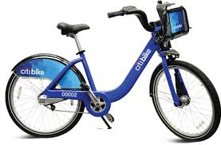
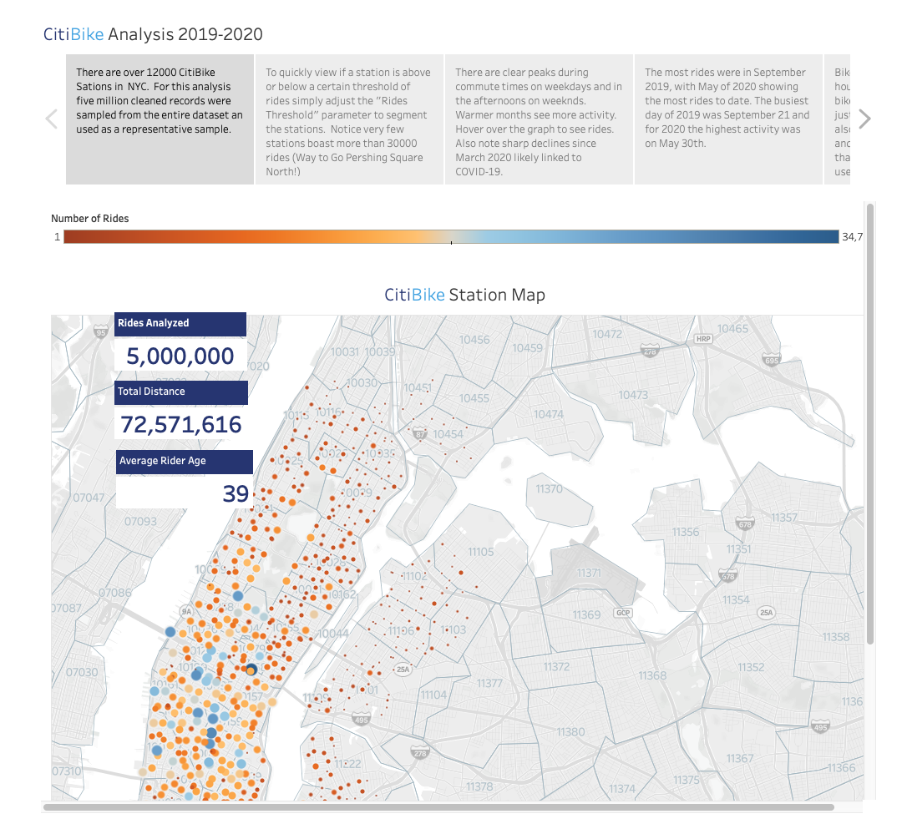
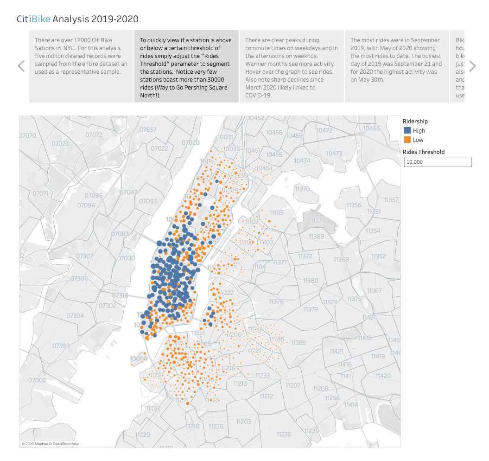
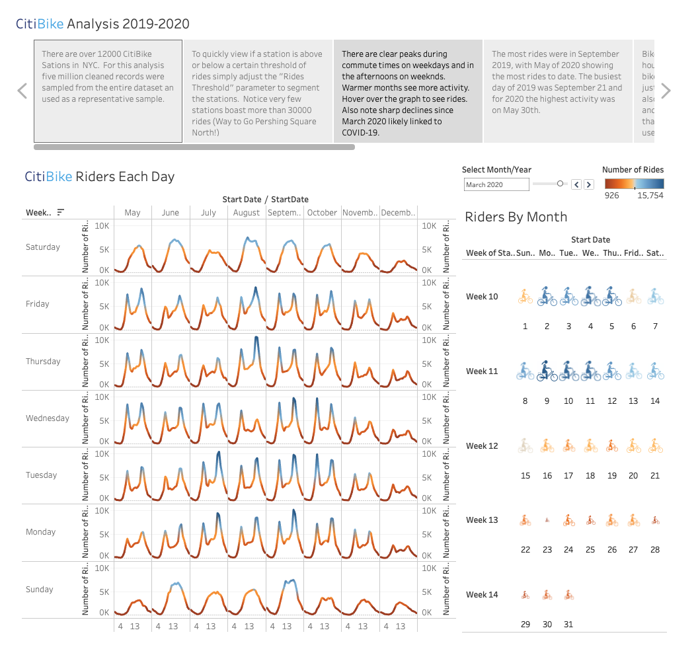
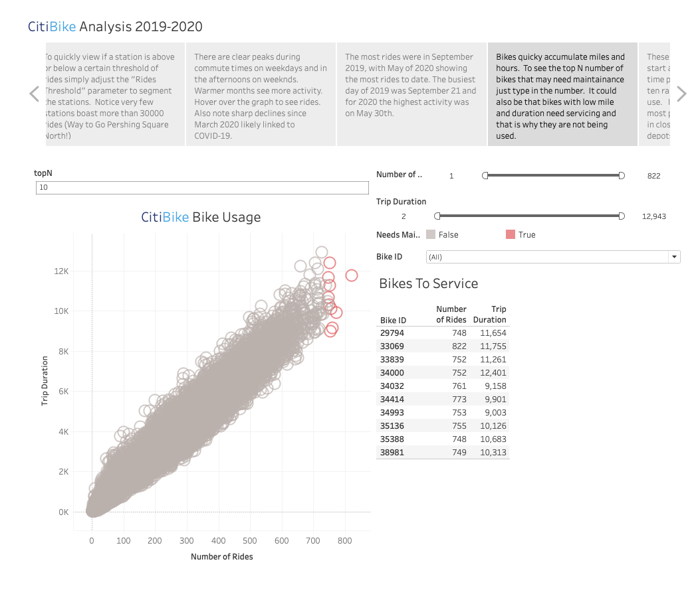
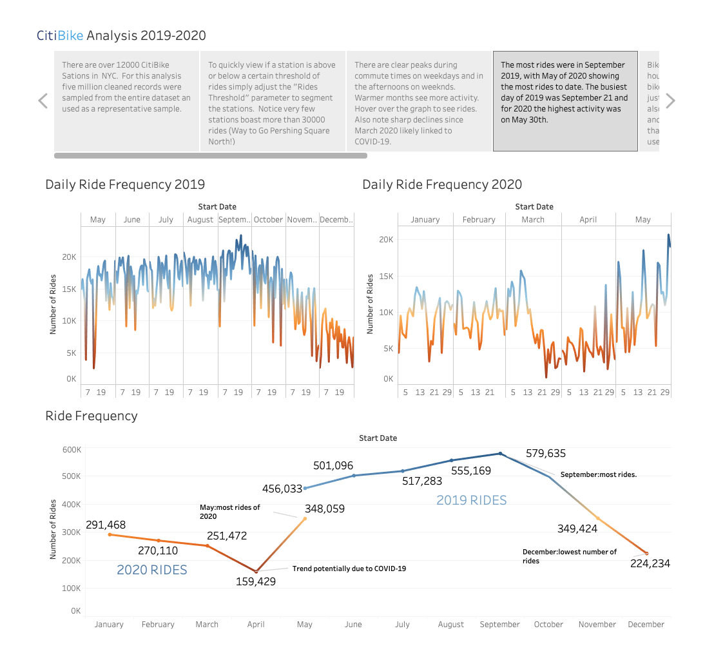
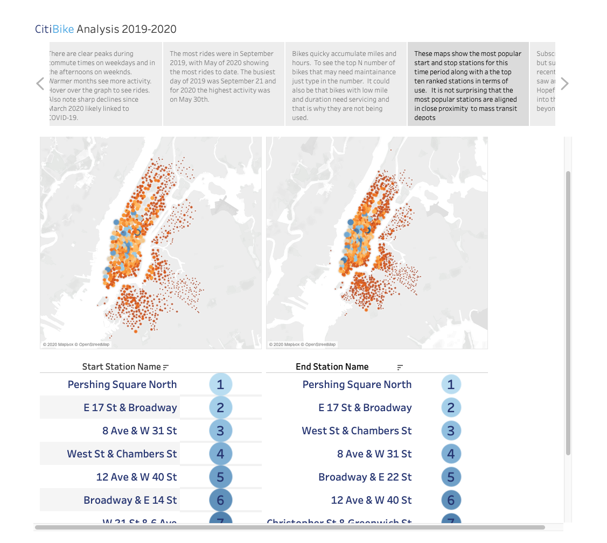
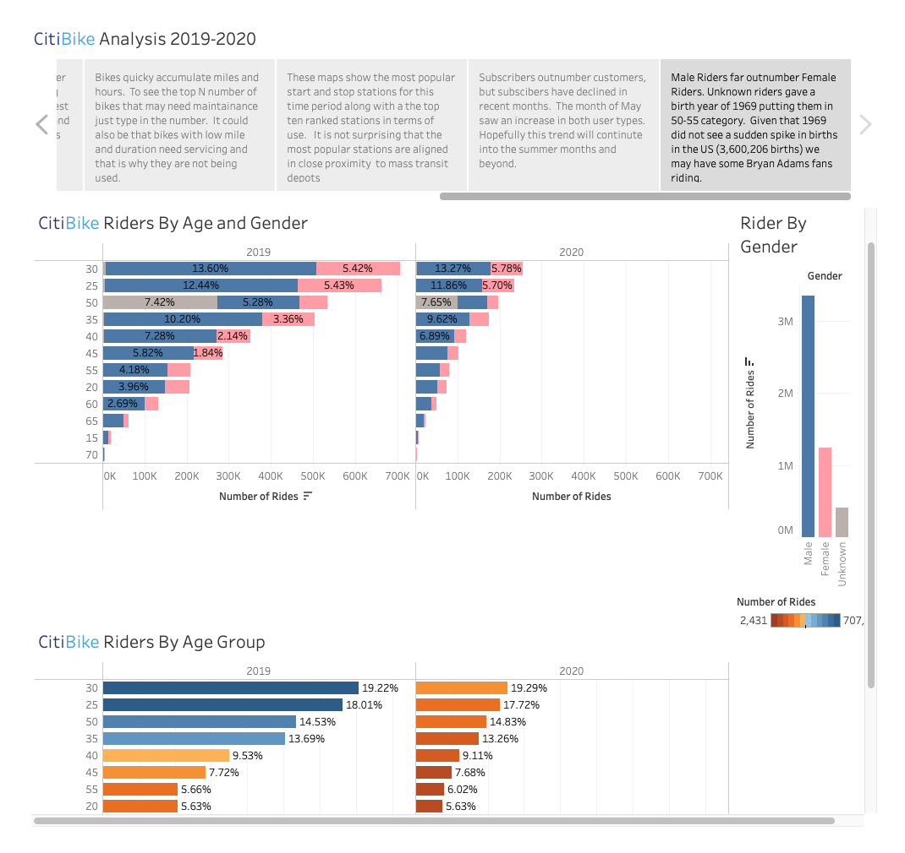

# Tableau Homework - Citi Bike Analytics

## Background

Since 2013, the Citi Bike Program has implemented a robust infrastructure for collecting data on the program's utilization. Through the team's efforts, each month bike data is collected, organized, and made public on the [Citi Bike Data](https://www.citibikenyc.com/system-data) webpage.

However, while the data has been regularly updated, the team has yet to implement a dashboard or sophisticated reporting process. City officials have a number of questions on the program, so your first task on the job is to build a set of data reports to provide the answers.

## Task

**The task in this assignment is to aggregate the data found in the Citi Bike Trip History Logs and find two unexpected phenomena.** 

**Design 2-5 visualizations for each discovered phenomena (4-10 total). The work is over a timespan of MAY 2019 to MAY 2020.** 

**The following are some of the questions answereed for this time period.**

* How many trips have been recorded total during the chosen period?
* By what percentage has total ridership grown?
* What are the peak hours in which bikes are used during summer months?
* What are the peak hours in which bikes are used during winter months?
* Today, what are the top 10 stations in the city for starting a journey? (Based on data, it is clear they are located near major transit hubs)
* Today, what are the top 10 stations in the city for ending a journey? (Based on data, it is clear they are located near major transit hubs)
* Today, what are the bottom 10 stations in the city for starting a journey? (Based on data, why?)
* Today, what are the bottom 10 stations in the city for ending a journey (Based on data, why?
* Today, what is the gender breakdown of active participants (Male v. Female)?
* How does the average trip duration change by age?
* What is the average distance in miles that a bike is ridden?
* Which bikes (by ID) are most likely due for repair or inspection in the timespan?
* How variable is the utilization by bike ID?

**Next, as a chronic over-achiever:**

* Dashboardsfor each phenomena were designed and shown below
* The dashboards should be accompanied with an analysis explaining why the phenomena may be occuring. 

**City officials would also like to see one of the following visualizations:**

* **Basic:** A static map that plots all bike stations with a visual indication of the most popular locations to start and end a journey with zip code data overlaid on top.

* **Advanced:** A dynamic map that shows how each station's popularity changes over time (by month and year). Again, with zip code data overlaid on the map.

* The map you choose should also be accompanied by a write-up unveiling any trends that were noticed during your analysis.

**Tableau Story**

* The Tableau story that brings together the visualizations, requested maps, and dashboards.
* Care was taken to  make it professional, logical, and visually appealing. 

### Requested Maps and Dashboards

## Notes
### Data Cleaning and Assumptions

### Copyright

Ann McNamara © 2020. All Rights Reserved.
